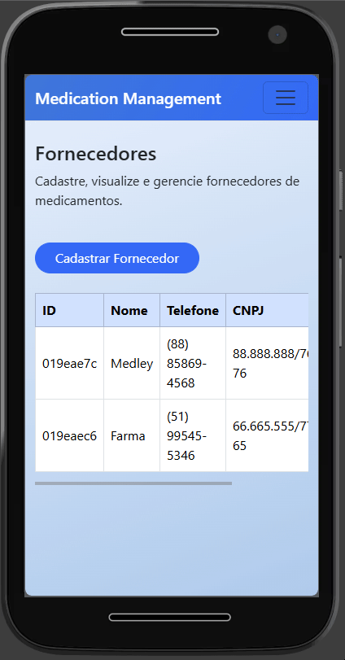
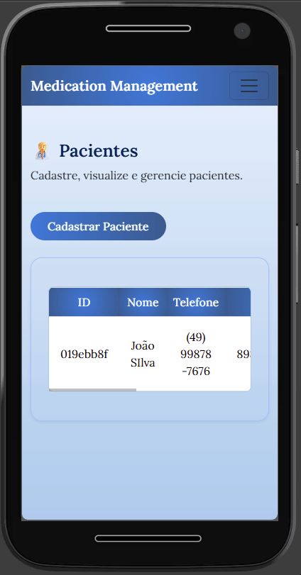
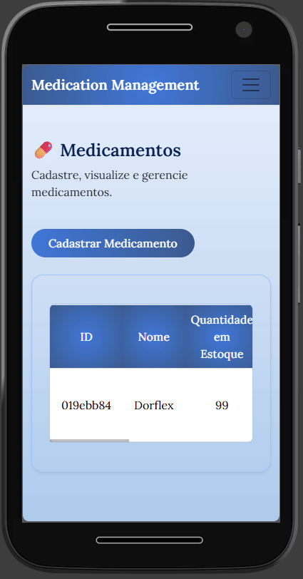
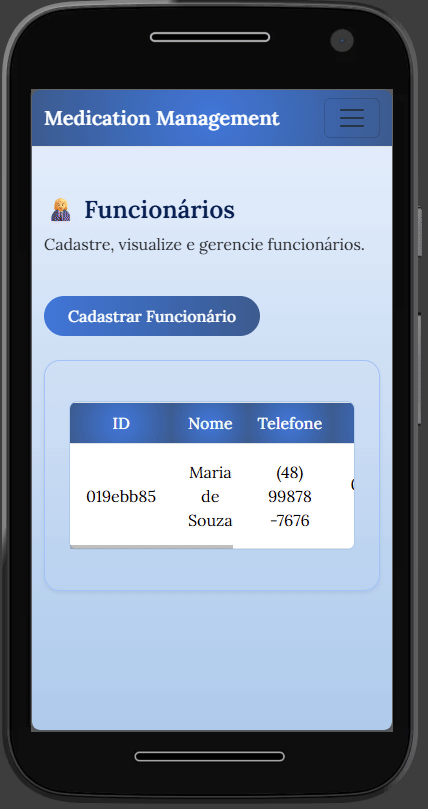

💊 Controle de Medicamentos
<p align="center">

</p>

Funcionalidades
🏷️ 1. Módulo de Fornecedores
<p align="center">

</p>

Requisitos Funcionais

- O sistema deve permitir registrar novos fornecedores
- O sistema deve permitir visualizar todos os fornecedores cadastrados
- O sistema deve permitir editar fornecedores existentes
- O sistema deve permitir excluir fornecedores cadastrados

Regras de Negócio

Campos obrigatórios:

- Nome (3 a 100 caracteres)
- Telefone (formatos válidos)
- CNPJ (14 dígitos)

** O sistema não deve permitir cadastro de fornecedores com mesmo CNPJ

🧑‍⚕️ 2. Módulo de Pacientes
<p align="center">

</p>

Requisitos Funcionais

- O sistema deve permitir registrar novos pacientes
- O sistema deve permitir visualizar todos os pacientes cadastrados
- O sistema deve permitir editar pacientes existentes
- O sistema deve permitir excluir pacientes cadastrados

Regras de Negócio

Campos obrigatórios:

- Nome (3 a 100 caracteres)
- Telefone (formatos válidos: (XX) XXXX-XXXX ou (XX) XXXXX-XXXX)
- Cartão do SUS (15 dígitos)
- CPF (11 dígitos)

** O sistema não deve permitir cadastro de pacientes com mesmo cartão do SUS

💊 3. Módulo de Medicamentos
<p align="center">

</p>

Requisitos Funcionais

- O sistema deve permitir registrar novos medicamentos
- O sistema deve permitir visualizar todos os medicamentos cadastrados
- O sistema deve permitir editar medicamentos existentes
- O sistema deve permitir excluir medicamentos cadastrados

Regras de Negócio

Campos obrigatórios:

- Nome (3 a 100 caracteres)
- Descrição (5 a 255 caracteres)
- Quantidade em estoque (número positivo)

Fornecedor

** O sistema deve destacar medicamentos com menos de 20 unidades como "em falta"
** O sistema deve atualizar a quantidade quando o medicamento já estiver cadastrado

👩‍💼 4. Módulo de Funcionários
<p align="center">

</p>

Requisitos Funcionais

- O sistema deve permitir registrar novos funcionários
- O sistema deve permitir visualizar todos os funcionários cadastrados
- O sistema deve permitir editar funcionários existentes
- O sistema deve permitir excluir funcionários cadastrados

Regras de Negócio

Campos obrigatórios:

- Nome (3 a 100 caracteres)
- Telefone (formatos válidos)
- CPF (11 dígitos)

** O sistema não deve permitir cadastro de funcionários com mesmo CPF

📦 5. Módulo de Estoque

5.1 Requisições de Entrada

<p align="center">

</p>

Requisitos Funcionais

- O sistema deve permitir registrar novas requisições de entrada
- O sistema deve permitir visualizar todas as requisições de entrada

Regras de Negócio

Campos obrigatórios:

- Data (válida)
- Medicamento (seleção obrigatória)
- Funcionário (seleção obrigatória)
- Quantidade (número positivo)

** O sistema deve atualizar o estoque ao registrar a requisição de entrada

5.2 Requisições de Saída

<p align="center">

</p>

Requisitos Funcionais

- O sistema deve permitir registrar novas requisições de saída
- O sistema deve permitir visualizar todas as requisições de saída

Regras de Negócio

Campos obrigatórios:

- Data (válida)
- Paciente (seleção obrigatória)
- Medicamentos requisitados (seleção obrigatória)

** O sistema não deve permitir requisição que exceda o estoque disponível
** O sistema deve subtrair a quantidade do estoque ao registrar a requisição

## Como utilizar

1. Clone o repositório ou baixe o código fonte.
2. Abra o terminal ou prompt de comando e navegue até a pasta raiz.
3. Utilize o comando abaixo para restaurar as dependências do projeto:

    ```bash
   dotnet restore
   ```
4. Para executar o projeto compilando em tempo real

   ```bash
   dotnet run --project ControleDeMedicamentosWeb.WebApp
   ```

## Requisitos

- .NET 10.0 SDK

## 👩‍💻 Colaboradores

1. Natália Bortoli Vieira - [@nataliavieirab](https://github.com/nataliavieirab)
2. Júlia Hartmann - [@JuliaaHartmann](https://github.com/JuliaaHartmann)
3. Revisado pela [Academia do Programador](https://academiadoprogramador.com.br)